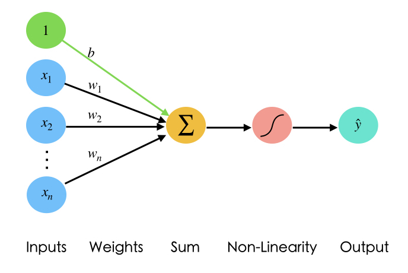
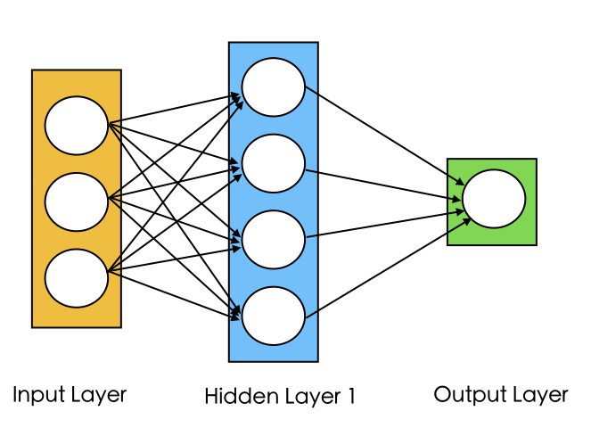

## Perceptron

Perceptron is a single neuron that calculates a linear combination of the input (i.e. performs a dot product with the input and its weights), adds a bias $b$, applies the non-linearity (or activation function), and outputs a value. If the activation function is sigmoid $\sigma$, the output is a number between 0 and 1.

$$\hat{y}=\sigma(b + \sum_{i=1}^n w_ix_i)$$

where $\sigma (t)=\frac{1}{1+e^{-t}}$


*Fig2. Representation of Perceptron*

## Common Activation Functions

1- **Sigmoid**. Sigmoid function takes a real-valued number and "squashes" it into range between 0 and 1. In particular, large negative numbers become 0 and large positive numbers become 1.

2- **Tanh**. Tanh function $tanh(x)=2\sigma(2x)-1$ squashes a real-valued number to the range [-1, 1]. Its output is zero-centered. Please note that the tanh neuron is simply a scaled sigmoid neuron.

3- **ReLU**. The Rectified Linear Unit has become very popular in the last few years. It computes the function $f(x)=max(0,x)$. In other words, the activation is simply thresholded at zero.

## Importance of Activation Functions

The purpose of activation functions is to introduce ***non-linearity*** into the network, which enables the network to separate the data that is not linearly separable. Linear functions always create linear decisions while non-linear functions allow to approximate arbitrarily complex functions.


*Fig3. Linear activation functions produce linear decisions*


*Fig4. Non-Linear activation functions produce non-linear decisions*

## Perceptron Simplified

We usually simplify the perceptron representation as below.


*Fig5. Simplified perceptron*

## Training a Neural Network

We will see how we can train a neural network through an example. Let's assume that out neural network architecture looks like the image shown below.


*Fig6. A 3-layer neural network with three inputs, two hidden layers of 4 neurons each and one output layer. [[Image Source](http://cs231n.github.io/neural-networks-1/)]*

We can see that the weights $\mathbf{W}$ and biases $\mathbf{b}$ are the only variables that affect the output $\hat{y}$. Therefore, training a neural network essentially means finding the right values for the weights and biases so that they can determine the best predictions. In other words, the process of fine-tuning the weights and biases from the input data is called training neural network.

Training a neural network involves two steps:

  1- Feed-forward computation

  2- backpropagation

### Feed-forward computation

Feed-forward step fundamentally means *repeated matrix multiplications combined with activation function*. Considering our example network, we convert the different variables into vectors and matrices. Therefore, the input  would be a [3x1] vector. The weights of the first hidden layer `W1` would be a [4x3] matrix, and its biases `b1` would be a [4x1] vector. In this layer, each neuron has its weights in a row of `W1`, so the matrix vector multiplication `np.dot(W1,x)` evaluates the activations of all neurons in this layer. Similarly, for the second hidden layer, `W2` and `b2` would be of size [4x4] and [4x1] respectively. Finally, for the last layer (output layer), `W3` and `b3` would be of size [1x4] and [1x1], respectively. The full forward pass of this 3-layer neural network is then simply three matrix multiplications, merged with the application of the activation function:

``` python
# forward-pass of a 3-layer neural network:
f = lambda x: 1/(1 + np.exp(-x)) # activation function (use sigmoid)
x = np.random.randn(3, 1) # random input vector of three numbers (3x1)
h1 = f(np.dot(W1, x) + b1) # calculate first hidden layer activations (4x1)
h2 = f(np.dot(W2, h1) + b2) # calculate second hidden layer activations (4x1)
out = np.dot(W3, h2) + b3 # output neuron (1x1)
```

We need to learn the Parameters `W1,W2,W3,b1,b2,b3` of the above network. Please note that the input `x` could be an entire batch of training data, where each example would be a column of `x`. In addition, the output layer usually doesn't have activation function and represents a real-valued number.

> Note: The forward pass of a fully-connected layer corresponds to one matrix multiplication followed by a bias offset and an activation function.

### Loss Function

performing a forward-pass of the network gives us the predictions. Therefore, we must evaluate the "goodness" of our predictions, which means we need to measure how far off our predictions are. **Loss function** enables us to do that. The loss function measures the cost caused by incorrect predictions.

if $\mathcal{L}(\hat{y}^{(i)},y^{(i)})$ is the loss of each example $i$ in the training set, for $i=1,2,\cdots,m$, then total loss $J(w)$ over the entire dataset is:

$$J(w)=\frac{1}{m}\sum_{i=1}^m \mathcal{L}(\hat{y}^{(i)},y^{(i)})$$


