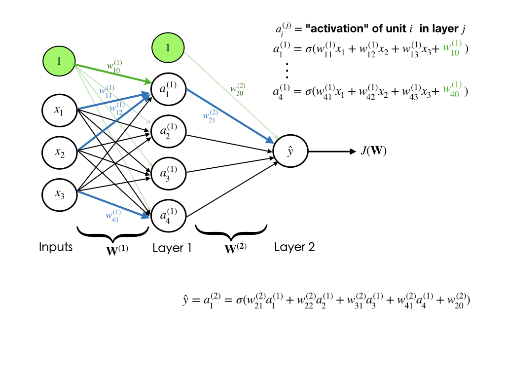
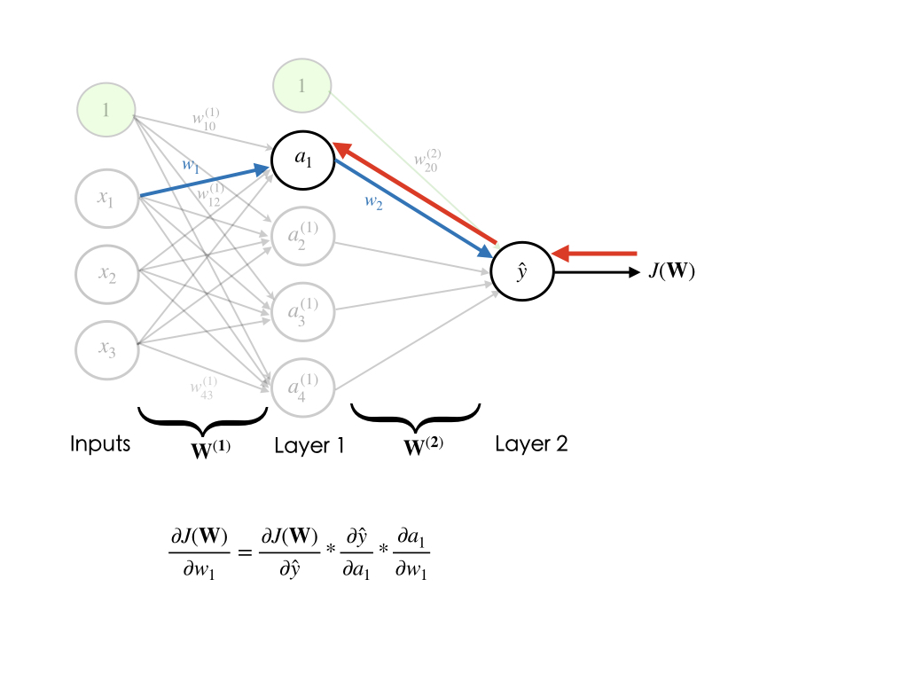

## Perceptron

Perceptron is a single neuron that calculates a linear combination of the input (i.e. performs a dot product with the input and its weights), adds a bias $b$, applies the non-linearity (or activation function), and outputs a value. If the activation function is sigmoid $\sigma$, the output is a number between 0 and 1.

$$\hat{y}=\sigma(b + \sum_{i=1}^n w_ix_i)$$

where $\sigma (t)=\frac{1}{1+e^{-t}}$

*Fig2. Representation of Perceptron*

## Common Activation Functions

1- **Sigmoid**. Sigmoid function takes a real-valued number and "squashes" it into range between 0 and 1. In particular, large negative numbers become 0 and large positive numbers become 1.

2- **Tanh**. Tanh function $tanh(x)=2\sigma(2x)-1$ squashes a real-valued number to the range [-1, 1]. Its output is zero-centered. Please note that the tanh neuron is simply a scaled sigmoid neuron.

3- **ReLU**. The Rectified Linear Unit has become very popular in the last few years. It computes the function $f(x)=max(0,x)$. In other words, the activation is simply thresholded at zero.

## Importance of Activation Functions

The purpose of activation functions is to introduce ***non-linearity*** into the network, which enables the network to separate the data that is not linearly separable. Linear functions always create linear decisions while non-linear functions allow to approximate arbitrarily complex functions.

*Fig3. Linear activation functions produce linear decisions*

*Fig4. Non-Linear activation functions produce non-linear decisions*

## Perceptron Simplified

We usually simplify the perceptron representation as below.

*Fig5. Simplified perceptron*

## Training a Neural Network

We will see how we can train a neural network through an example. Let's assume that our neural network architecture looks like the image shown below.

We can see that the weights $\mathbf{W}$ and biases $\mathbf{b}$ are the only variables that affect the output $\hat{y}$. Therefore, training a neural network essentially means finding the right values for the weights and biases so that they can determine the best predictions. In other words, the process of fine-tuning the weights and biases from the input data is called training neural network.

Training a neural network involves two steps:

  1- Feed-forward computation

  2- backpropagation

### Feed-forward computation

Feed-forward step fundamentally means *repeated matrix multiplications combined with activation function*. Considering our example network, we convert the different variables into vectors and matrices. Therefore, the input  would be a [3x1] vector. The weights of the first hidden layer `W1` would be a [4x3] matrix, and its biases `b1` would be a [4x1] vector. In this layer, each neuron has its weights in a row of `W1`, so the matrix vector multiplication `np.dot(W1,x)` evaluates the activations of all neurons in this layer. For the last layer (output layer), `W2` and `b2` would be of size [1x4] and [1x1], respectively. The full forward pass of this 3-layer neural network is then simply three matrix multiplications, merged with the application of the activation function:

Therefore, the forward-pass is:

We need to learn the Parameters `W1,W2,b1,b2` of the above network. Please note that the input `x` could be an entire batch of training data, where each example would be a column of `x`.

> Note: The forward pass of a fully-connected layer corresponds to one matrix multiplication followed by a bias offset and an activation function.

### Loss Function

performing a forward-pass of the network gives us the predictions. Therefore, we must evaluate the "goodness" of our predictions, which means we need to measure how far off our predictions are. **Loss function** enables us to do that. The loss function measures the cost caused by incorrect predictions.

if $\mathcal{L}(\hat{y}^{(i)},y^{(i)})$ is the loss of each example $i$ in the training set, for $i=1,2,\cdots,m$, then total loss $J(W)$ over the entire dataset is:

$$J(W)=\frac{1}{m}\sum_{i=1}^m \mathcal{L}(\hat{y}^{(i)},y^{(i)})$$

Please note that $W=[W^{(1)}, W^{(2)},\cdots, W^{(L)}]$, where $W^{(j)}$ is matrix of weights of layer $j$

### Cross Entropy Loss

Cross entropy loss is used in classification problems and outputs a probability between 0 and 0. If problem is a *binary* classification, the binary cross entropy loss is:

$$J(W)=-\frac{1}{m}\sum_{i=1}^m \left[ y^{(i)}\log(\hat{y}^{(i)}) + (1-y^{(i)})\log(1-\hat{y}^{(i)})\right]$$

When the number of classes is $K$, where $K>2$ (i.e. multi-class classification), we essentially calculate a separate loss for each class label per training example and sum the result. Therefore the cross entropy loss is:

$$J(W)=-\frac{1}{m}\sum_{i=1}^m \sum_{c=1}^K y^{(i)}_c\log(\hat{y}^{(i)}_c) + (1-y^{(i)}_c)\log(1-\hat{y}^{(i)}_c)$$

### Mean Squared Error Loss

Mean squared error loss is used in regression problems and outputs a real-valued number.

$$J(W)=\frac{1}{m}\sum_{i=1}^m \left( y^{(i)} - \hat{y}^{(i)} \right)^2$$

### Backpropagation

Our goal in training is to find the weights and biases that minimizes the loss function:

$$W^* = \underset{W}{\arg\min}\ J(W)$$

After we measured the loss, we need to find a way to **propagate** the error back, and update our weights and biases, in order to decrease the loss. But how much should we adjust the weights and biases.

In order to find the appropriate amount of change in the weights and biases, we need to take the derivative of the loss function with respect to the weights and biases. The process of computing gradients of expressions through recursive application of chain rule is called **backpropagation**. When we have the gradients, we can use the *gradient descent* algorithm to update the weights (i.e. minimize the loss function).

For instance, if we are going to compute the gradient with respect to $w_1$, in our example network below, we have:

We need to repeat this **for every weight in the network** using gradients from later layers.

### Gradient Descent

Gradient descent algorithm is as follows:
1. Initialize the weights randomly $\sim N(0,\sigma^2)$
2. Loop until convergence:
   - For all the examples
      - Compute gradient, $\frac{\partial J(\mathbf{W})}{\partial \mathbf{W}}$

   - Update weights, $W = W-\eta \frac{\partial J(W)}{\partial W}$
3. Return weights

*Fig5. Representation of a loss function with two parameters.[[Image Source](https://stackoverflow.com/questions/39340429/what-is-the-meaning-of-iterations-of-neural-network-gradient-descent-steps-epo/48012097)]*

Since gradient descent algorithm iterates over all the training examples and then updates the weights, it will be slow when the size of the training set is too large. Thus, instead of using gradient descent, we will use **Stochastic Gradient Descent (SGD)**. Stochastic gradient descent picks a single example and updates the weight. Therefore, SGD is easy to compute. However it's very noisy. Below is SGD algorithm:

1. Initialize the weights randomly $\sim N(0,\sigma^2)$
2. Loop until convergence:
   - Pick single example $i$
   - Compute gradient, $\frac{\partial J_i(\mathbf{W})}{\partial \mathbf{W}}$

   - Update weights, $W = W-\eta \frac{\partial J(W)}{\partial W}$
3. Return weights

Although SGD reduce the computations enormously, it's very noisy because it randomly picks one data point from the whole data set at each iteration. Therefore, in practice, we choose a small number of data points instead of just one point at each step, which is called **mini-batch gradient descent**. Mini-batch gradient descent has the goodness of gradient descent and speed of SGD, and it's algorithm is:

1. Initialize the weights randomly $\sim N(0,\sigma^2)$
2. Loop until convergence:
   - For a batch of $B$ examples
      - Compute gradient, $\frac{\partial J(\mathbf{W})}{\partial \mathbf{W}}$

   - Update weights, $W = W-\eta \frac{\partial J(W)}{\partial W}$
3. Return weights

### Setting the Learning Rate in Gradient Descent

When using gradient descent, one of the hyperparameters that we need to set is *learning rate* or *step size* $\eta$. Learning rate controls the amount that weights are updated during training. So it determines how quickly or slowly the neural network is trained. If the learning rate is large, the model learns faster. However, we may risk overshooting the lowest point and find a sub-optimal final set of weights. A small learning rate allows the model to learn a more optimal or even globally optimal set of weights but may take significantly longer to train.

*Fig6. Learning rate with different values. [[Image Source](https://www.jeremyjordan.me/nn-learning-rate/)]*

### How to Find the Optimal Learning Rate

**Approach 1.** Try many different learning rates and see which one works well.

**Approach 2.** Learning rate annealing (or adaptive learning rate). In this approach we start with a relatively high learning rate and then gradually lowering the learning rate during training. The most common form of adaptive learning rate is a *step decay* where the learning rate is reduced by some percentage after a set number of training epochs.

### Overfitting Problem

*Fig6. Model fitting scenarios. [[Image Source](https://medium.com/analytics-vidhya/regularization-in-machine-learning-and-deep-learning-f5fa06a3e58a)]*

Underfitting is when the learning model is too simple (i.e. represented by too few features or regularized too much) that it cannot model the training data and generalize to new data. Underfitted models have high bias and low variance. They tend to have low variance in their predictions because they are simple, and have high bias towards outcomes because they cannot learn the underlying data and destroy the accuracy of the model. On the contrary, overfitting is a problem when a learning model learns the data too well that it starts learning the noise or random fluctuations in the training data. Therefore, the model closely explains the training data but fails to generalize to new data. Overfitted models tend to have high variance and low bias because they are more complex, they have more flexibility (low bias) and can capture more variations of the data (high variance). Thus, there should always be a trade-off between bias and variance of the model.

### How to Prevent Overfitting

**Regularization.** It's a technique that constrains the models to be simpler, so it discourages complex models, which helps improve the generalization of the model on the unseen data. Lasso regularization (L1) and ridge regularization (L2) are most popular techniques. The basic idea is these techniques add a penalty term to the cost function and try the disallow the coefficients from getting so large by pushing them to zero.

**Dropout.** It's another popular technique for preventing overfitting in training neural networks. The intuition is to drop out some of the units (i.e. randomly set some activations to zero).

*Fig7. Dropout neural network. [[Image Source](http://jmlr.org/papers/volume15/srivastava14a/srivastava14a.pdf)]*

**Early Stopping.** In this technique, we set an arbitrarily large number of epochs and stop the training when the performance of the model stops improving on the validation dataset. An epoch is one full pass of the training dataset.

*Fig8. Early stopping. [[Image Source](https://mc.ai/why-early-stopping-works-as-regularization/)]*

### Full Backpropagation Step of the Example 2-layer Network

The full backpropagation of our model is: ($\odot$ is the element-wise multiplication)

### Let's Code it Up

Now it's time to put it all together and implement our example neural network.

